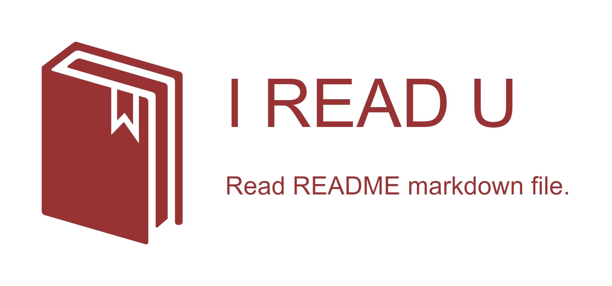

[日本語](README.ja.md) / [English](README.md)

<p align="center">

</p>

[](https://www.npmjs.com/package/i-read-u)
[](https://circleci.com/gh/s2terminal/i-read-u)
[](https://codeclimate.com/github/s2terminal/i-read-u/maintainability)
[](https://codeclimate.com/github/s2terminal/i-read-u/test_coverage)
[](https://dependabot.com)

# I read you (ireadu)
Extracting commands from README markdown file.


Supported on Linux, Windows Subsystems for Linux and macOS.

## Installation
```bash
$ npm install --global i-read-u
```

### Requirements
Node.js v6.0+

## Usage
```bash
$ ireadu
$ ireadu ./CONTRIBUTING.md
```
More usage information can be obtained from `$ ireadu --help`.

### Test Commands (Try ireadu command and hit this)
```bash
$ ls
$ pwd
> w
>id
```

## Developing
git clone and run this.
```bash
$ npm install --save-dev
$ npm run webpack-watch
$ bin/ireadu.js
```

### Linting
```bash
$ npm run lint
$ npm run lint:fix
```

### Testing
```bash
$ npm test
$ file=coverage/lcov-report/index.html && if type cmd.exe; then cmd.exe /c start ${file}; else open ${file}; fi
```

## License
Copyright (c) 2018 [s2terminal / suzuki\.sh](https://www.s2terminal.com/) (Twitter: [suzukiterminal](https://twitter.com/suzukiterminal))
Licensed under the [MIT license](LICENSE).
